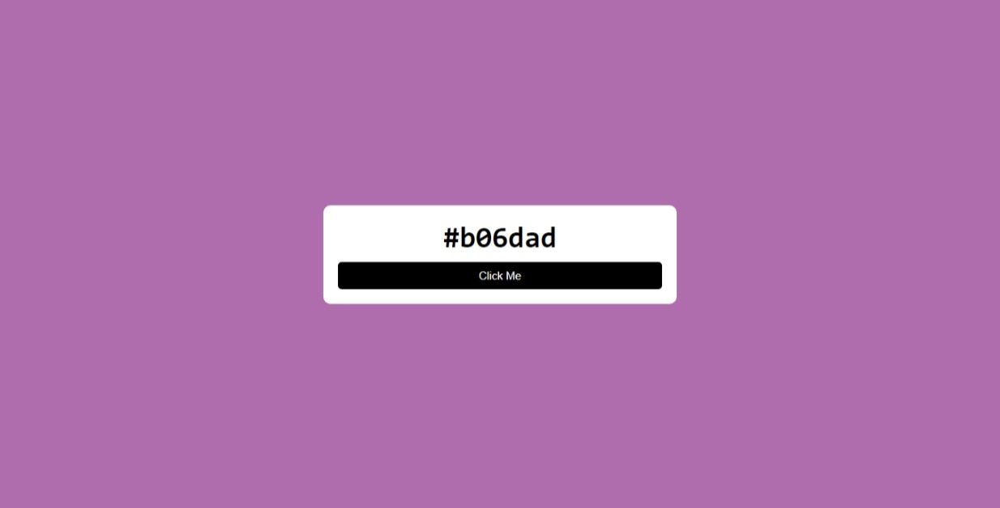
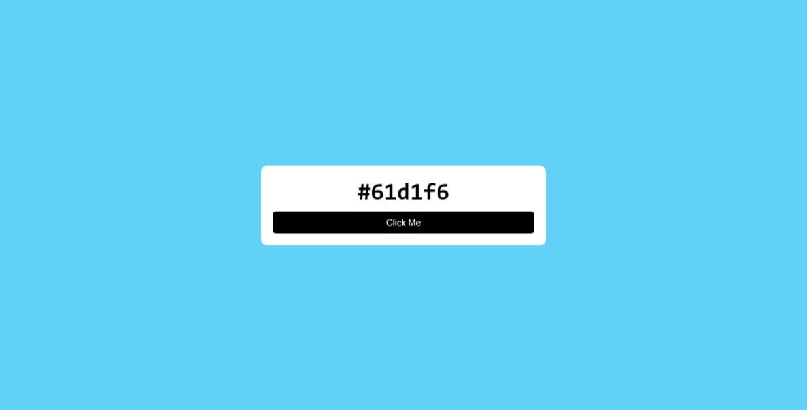

# 🎨 Color Generator

Welcome to the **Color Generator** project! This simple and elegant web application generates random colors and displays their hexadecimal codes. It's a fun way to explore colors and get inspiration for your design projects.

## 📸 Screenshots






## 📚 Features

- Generate random colors with a single click.
- Display the generated color's hexadecimal code.
- Copy the color code to the clipboard automatically.
- Clean and responsive design.

## 🛠 Technologies Used

- HTML
- CSS
- JavaScript

## 🚀 Demo

Check out the live demo of the Color Generator on GitHub [Pages](https://gupta-ravi.github.io/ColorGenrator/)

## 📺 YouTube Tutorial

Watch the YouTube tutorial to learn how to build this project step-by-step:
[YouTube Tutorial](https://youtu.be/T0DLc0XlPV8)

## 📝 Usage

1. Clone this repository to your local machine.
   
   ```bash
   git clone https://github.com/Gupta-Ravi/ColorGenerator.git
   ```

2. Open index.html in your favorite browser.

## 📂 File Structure

- `index.html`: The main HTML file.
- `style.css`: The CSS file for styling the application.
- `README.md`: The file you're currently reading.

## 🖌️ Customization

Feel free to customize the project by modifying the HTML, CSS, and JavaScript files according to your needs. Add more features, improve the design, or integrate it into a larger project!

## 👩‍💻 Contributing

Contributions are welcome! If you have any suggestions or improvements, please create an issue or submit a pull request.

## 📄 License

This project is licensed under the MIT License.

---

Happy coding! 🎉
